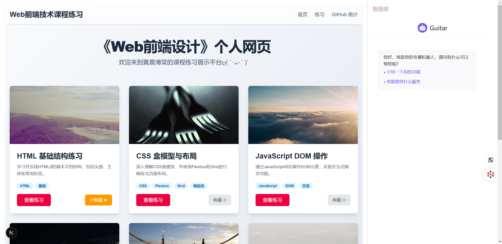
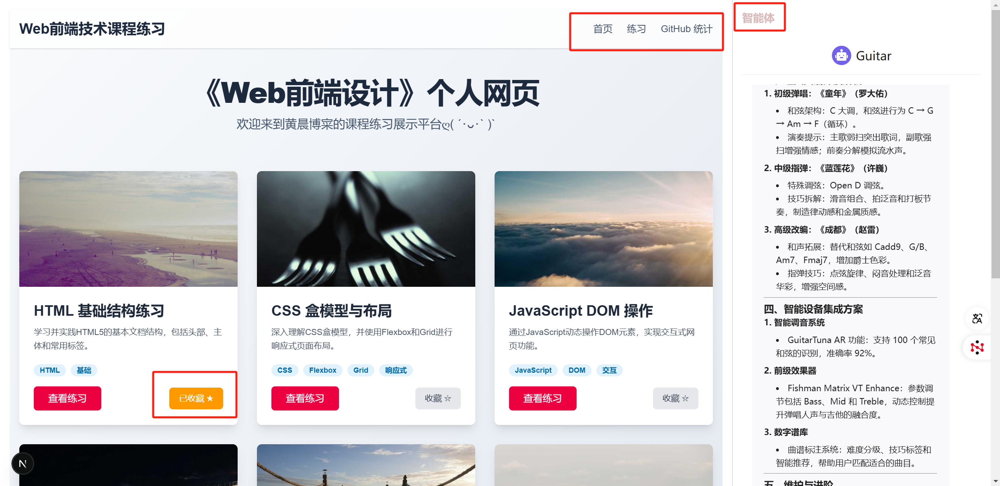
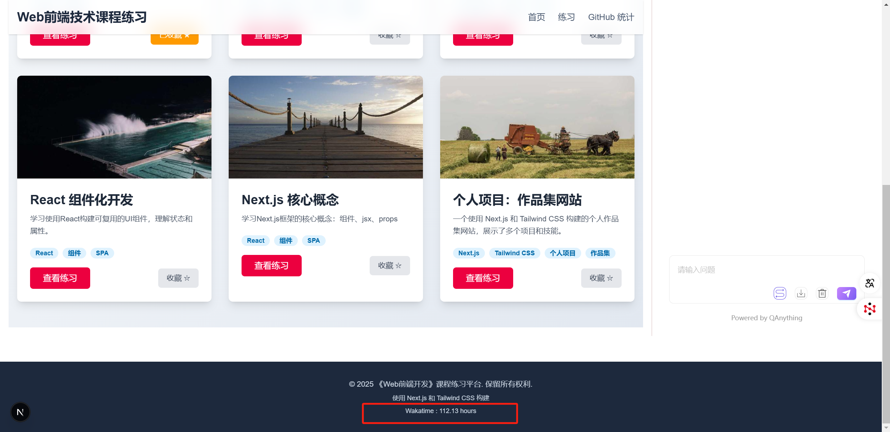

# 《Web前端设计》个人网页项目

本项目是《Web前端设计》课程的个人项目最终成果，旨在全面展示在课程中所学的各项Web前端技术。它不仅是一个静态的作品集，更是一个采用现代化技术栈（如 Next.js 和 Tailwind CSS）构建的、功能丰富且响应式的Web应用。项目深度整合了课程中的所有练习，并创新性地集成了 QAnything 私有化大模型和 WakaTime API，以提供智能交互和动态数据展示的独特体验。

## 项目简介

该项目核心是一个个人作品集与课程练习的在线展示平台。它清晰地展示了从基础的 HTML、CSS、JavaScript 练习，到使用 React 和 Next.js 进行高级组件化开发的学习路径和成果。项目整体设计追求简洁、专业和现代化，极度注重用户在不同设备上的访问体验、代码的可读性与长期可维护性。

## ✨ 功能特性

- **全面的课程练习展示**：系统化地集成了从HTML基础到JavaScript高级应用的全部课程作业。
- **现代化技术栈**：采用 Next.js、React 和 Tailwind CSS，保证了项目的高性能和开发效率。
- **智能助手集成**：通过API集成了QAnything大模型，提供了一个可以进行项目问答和技术交流的智能聊天机器人。
- **动态编码统计**：集成WakaTime API，在页脚实时展示开发者的编码活动统计，增加了项目的个性化和趣味性。
- **完全响应式设计**：确保在桌面、平板和手机等不同尺寸的设备上都能获得完美的视觉和交互体验。

## 🛠️ 技术栈

- **核心框架**: Next.js, React
- **样式方案**: Tailwind CSS
- **API 集成**: QAnything API, WakaTime API
- **开发语言**: JavaScript (ES6+)
- **包管理器**: npm

## 🤖 QAnything 集成

### 集成路径选择

考虑到项目的静态化特性和 Next.js 的强大功能，我们选择通过**API调用**的方式集成 QAnything，而不是直接嵌入其标准HTML页面。此方案的优势在于：

*   **前后端分离**：该方式完全符合现代Web开发的前后端分离思想，让前端代码更纯粹地关注UI/UX，后端则专注于业务逻辑和AI模型的服务。
*   **灵活性与可扩展性**：通过API，我们可以极度灵活地处理和展示QAnything返回的数据，例如对返回结果进行二次格式化、实现本地缓存策略或与其他数据源进行聚合展示。
*   **性能优化**：Next.js 的服务端渲染（SSR）和静态站点生成（SSG）可以与API调用无缝结合。我们可以在构建时或请求时预先获取数据，从而极大地优化页面加载性能和用户体验。

### 实现细节

我们在全局布局文件 `src/app/layout.js` 中为 QAnything 聊天机器人规划并创建了一个专用的侧边栏容器。接着，通过一个独立的React组件来封装所有与 QAnything API 的交互逻辑。该组件精密地负责处理用户的输入、向API后端发送请求、接收并优雅地展示机器人的实时回复。

**QAnything 运行截图**

## 📊 WakaTime API 集成

为了动态、直观地展示个人的编码活动和投入，项目集成了 WakaTime API。通过该API，我们可以实时获取总编码时长等关键统计数据，并将其优雅地展示在网站的页脚部分，成为一个有趣的个人签名。

### 实现方法

1.  **创建 Cloudflare Worker 作为安全代理**：为了绝对安全地在前端调用 WakaTime API（避免在客户端代码中暴露私密的 API Key），我们创建了一个 Cloudflare Worker 作为中间层代理。该 Worker 负责接收来自前端的请求，然后附加API Key，安全地向 WakaTime API 发起真实请求，并将干净的结果返回给前端。
2.  **前端组件化实现**：在 `src/components/Footer.js` 页脚组件中，我们利用 `useEffect` Hook，在组件首次加载到DOM时，异步触发对上述 Cloudflare Worker 的网络请求。获取到编码时长数据后，通过 `useState` Hook 将其更新到界面状态上，从而实现数据的动态展示。

**WakaTime API 集成与展示截图**

## 📂 Next.js 项目结构

项目严格遵循 Next.js 的 App Router 模式构建，目录结构清晰、模块化，非常易于理解和后期维护。
